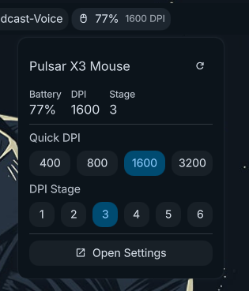

# Pulsar X3 Mouse - DMS Plugin

A [Dank Material Shell](https://github.com/nicholasyager/dank-material-shell) plugin for monitoring and controlling your Pulsar X3 gaming mouse.



## Features

- Battery percentage display in the bar
- Current DPI display
- Quick DPI presets (400, 800, 1600, 3200)
- DPI stage selector (1-6)
- Opens full settings GUI

## Requirements

- [pulsar-x3-python](https://github.com/jonkristian/pulsar-x3-python) installed (`pulsar-x3` CLI must be available)

## Installation

Clone this repository into your DMS plugins directory:

```bash
cd ~/.config/DankMaterialShell/plugins
git clone https://github.com/jonkristian/dms-pulsar-x3.git pulsar-x3
```

Reload DMS and enable the plugin in settings.